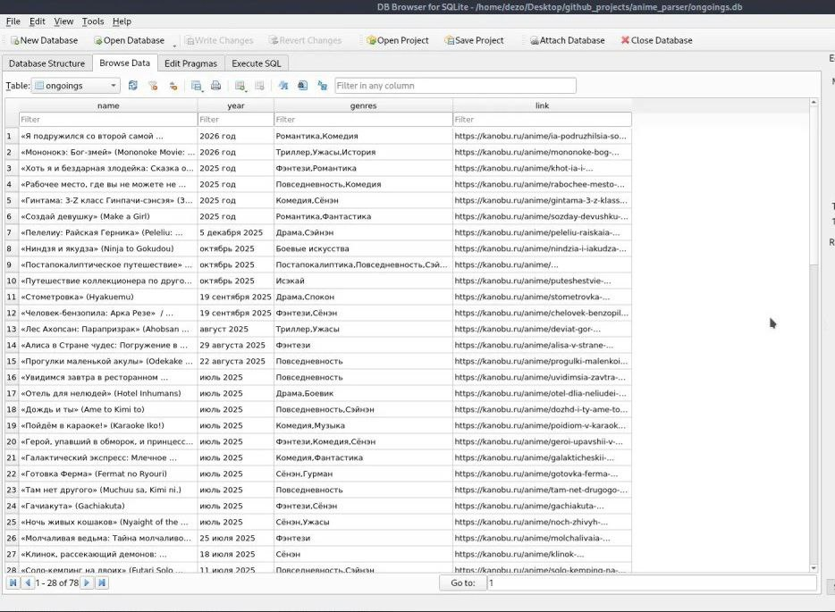

***This project i made for my portfolio but if you want you can run this***
# About
This script parse site with anime ongoings.
* For this goal i used: BeautifulSoup and SQL

### How to run?:

1. You need download requirements:
    `pip install -r requirements.txt`
2. Now you can run this:
   `python main.py`

## EXAMPLE

